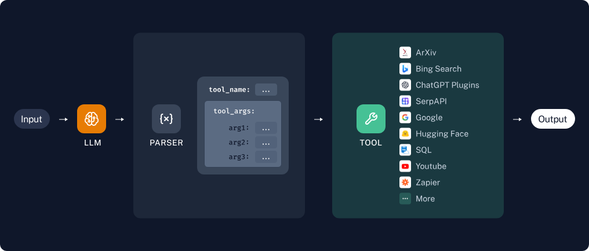
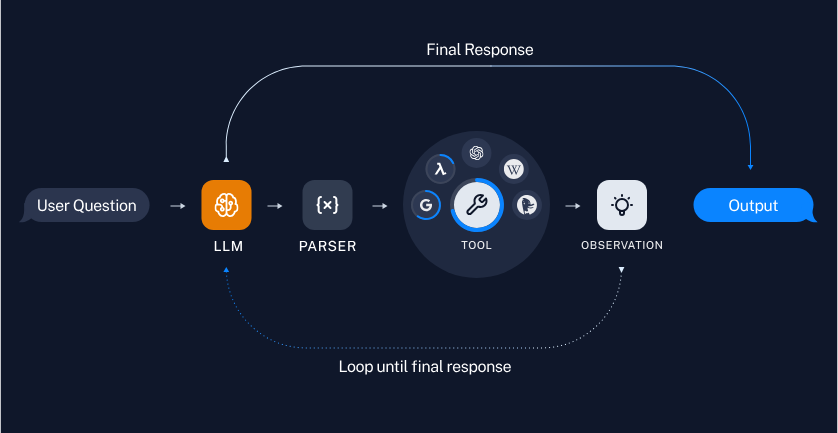

# LangChain 智能体：使用自定义工具

## 简介

在这篇文章中，我们将基于 [LangChain 官方文档](https://python.langchain.com/docs/use_cases/tool_use/)，详细介绍如何使用 LangChain 创建自定义工具，并在链（Chains）和智能体（Agents）中使用。

## 安装 LangChain

首先，通过以下命令安装 LangChain：

```bash
pip install --upgrade --quiet langchain
```

**注释**：此命令会升级或安装 LangChain 包，`--quiet` 参数用于抑制不必要的输出。

如果你希望追踪运行过程，可以设置环境变量开启 LangSmith：

```python
import getpass
import os

os.environ["LANGCHAIN_TRACING_V2"] = "true"
os.environ["LANGCHAIN_API_KEY"] = getpass.getpass("Enter your API key: ")
```

**注释**：这里我们使用了 `getpass` 库来安全地获取 API 密钥，确保不会在命令行中泄露。

## 创建自定义工具

LangChain 允许你从 Python 函数创建自定义工具。以下是一个简单的乘法工具示例：

```python
from langchain_core.tools import tool

@tool
def multiply(first: int, second: int) -> int:
    "将两个整数相乘。"
    return first * second

# 打印工具的名称、描述和参数
print("Tool Name:", multiply.name)
print("Tool Description:", multiply.description)
print("Tool Arguments:", multiply.args)
```

**注释**：我们定义了一个 `multiply` 函数，并使用 `@tool` 装饰器将其转换为 LangChain 工具。然后，我们打印出工具的相关信息，以便用户了解其用法。

```text
Tool Name: multiply
Tool Description: multiply(first: int, second: int) -> int - Multiply two integers together.
Tool Arguments: {'first': {'title': 'First', 'type': 'integer'}, 'second': {'title': 'Second', 'type': 'integer'}}
```

## 链（Chains）

链允许你预定义一系列工具的使用顺序。



下面是一个简单的示例，展示如何创建一个支持乘法计算的链：

### 工具调用

使用 LLM 与工具结合的一种方法是通过工具调用 API。这需要模型支持工具调用，具体支持情况可以查看 [官方文档](https://python.langchain.com/docs/integrations/chat/)。

首先，我们需要定义模型和工具：

```python
import getpass
import os
from langchain_openai import ChatOpenAI

os.environ["OPENAI_API_KEY"] = getpass.getpass("Enter your OpenAI API key: ")

llm = ChatOpenAI(model="gpt-3.5-turbo")
```

**注释**：我们设置了 OpenAI API 密钥，并初始化了一个 `ChatOpenAI` 对象。

我们使用 `bind_tools` 方法将工具的定义作为模型调用的一部分传递：

```python
llm_with_tools = llm.bind_tools([multiply])
```

**注释**：这样，模型就可以在适当的时候调用 `multiply` 工具了。

当模型调用工具时，相关信息会显示在输出的 `AIMessage.tool_calls` 属性中：

```python
msg = llm_with_tools.invoke("3 乘以 5 等于多少?")
print("Tool Call:", msg)
```

**注释**：这里我们调用了模型，并打印出了工具调用的详细信息。

```text
Tool Call: content='' additional_kwargs={'tool_calls': [{'id': 'call_i48IbegPCTX8s2F7dD2G5llX', 'function': {'arguments': '{"first": 3, "second": 5}', 'name': 'multiply'}, 'type': 'function'}, {'id': 'call_qCws40dvjcEXpdcJLq3yZtIX', 'function': {'arguments': '{"first": 5, "second": 3}', 'name': 'multiply'}, 'type': 'function'}]} response_metadata={'token_usage': {'completion_tokens': 49, 'prompt_tokens': 72, 'total_tokens': 121}, 'model_name': 'gpt-3.5-turbo', 'system_fingerprint': 'fp_c2295e73ad', 'finish_reason': 'tool_calls', 'logprobs': None} id='run-3ee6b1df-60c5-4c80-8851-621b324937da-0' tool_calls=[{'name': 'multiply', 'args': {'first': 3, 'second': 5}, 'id': 'call_i48IbegPCTX8s2F7dD2G5llX'}, {'name': 'multiply', 'args': {'first': 5, 'second': 3}, 'id': 'call_qCws40dvjcEXpdcJLq3yZtIX'}]
```

### 调用工具

为了实际调用工具，我们需要将生成的工具参数传递给工具。以下是一个提取和使用工具参数的示例：

```python
from operator import itemgetter

chain = llm_with_tools | (lambda x: x.tool_calls[0]["args"]) | multiply
result = chain.invoke("6 乘以 8 等于多少?")
print("Result:", result)
```

**注释**：我们创建了一个简单的管道，首先提取工具调用的参数，然后将其传递给 `multiply` 工具，并打印出最终结果。

```text
Result: 48
```

## 智能体（Agents）

智能体允许模型自己决定使用工具的次数和顺序。LangChain 提供了多种内置智能体，适用于不同的用例。



为了测试智能体对多个工具的调用，我们另外创建了两个工具：加法和指数运算。

```python
@tool
def add(first_int: int, second_int: int) -> int:
    "将两个整数相加。"
    return first_int + second_int

@tool
def exponentiate(base: int, exponent: int) -> int:
    "求底数的幂次方。"
    return base**exponent

tools = [multiply, add, exponentiate]
```

以下是一个使用智能体调用工具的示例：

```python
from langchain import hub
from langchain.agents import AgentExecutor, create_openai_tools_agent

# 获取并打印智能体提示
prompt = hub.pull("hwchase17/openai-tools-agent")
prompt.pretty_print()

# 构建工具调用智能体
agent = create_openai_tools_agent(llm, tools, prompt)

# 创建智能体执行器
agent_executor = AgentExecutor(agent=agent, tools=tools, verbose=True)

# 使用智能体执行复杂计算
output = agent_executor.invoke(
    {"input": "3 的五次方乘以 12 加 3 的和，然后对整个结果求平方"}
)
print("Agent Output:", output)
```

**注释**：我们首先获取了一个智能体提示：

```text
================================ System Message ================================

You are a helpful assistant

============================= Messages Placeholder =============================

{chat_history}

================================ Human Message =================================

{input}

============================= Messages Placeholder =============================

{agent_scratchpad}
```

然后，我们创建了一个智能体和智能体执行器，并使用它来执行一个复杂的数学计算。最后，我们打印出了智能体的执行过程和最后的输出结果。

```text
> Entering new AgentExecutor chain...

Invoking: `multiply` with `{'first': 3, 'second': 3}`

9
Invoking: `add` with `{'first_int': 9, 'second_int': 12}`

21
Invoking: `exponentiate` with `{'base': 21, 'exponent': 2}`

441最终结果是 441。

> Finished chain.
Agent Output: {'input': '3 的五次方乘以 12 加 3 的和，然后对整个结果求平方', 'output': '最终结果是 441。'}
```

## 错误处理和调试

在使用 LangChain 时，可能会遇到一些错误。以下是一些常见的错误处理和调试建议：

- **检查 API 密钥**：确保你的 API 密钥是有效的，并且没有过期。
- **网络问题**：如果你的请求失败，检查你的网络连接是否正常。
- **参数匹配**：确保传递给工具的参数与其定义相匹配。
- **查看日志**：LangChain 的日志可以提供有关错误的详细信息，有助于调试。
- **查看跟踪信息**：如果你启用了 LangSmith，可以查看跟踪信息来了解模型的执行过程。

## 完整代码

```python
import dotenv
from langchain import hub
from langchain.agents import AgentExecutor, create_openai_tools_agent
from langchain_core.tools import tool
from langchain_openai import ChatOpenAI

dotenv.load_dotenv()


@tool
def multiply(first: int, second: int) -> int:
    "将两个整数相乘。"
    return first * second


@tool
def add(first_int: int, second_int: int) -> int:
    "将两个整数相加。"
    return first_int + second_int


@tool
def exponentiate(base: int, exponent: int) -> int:
    "求底数的幂次方。"
    return base**exponent


tools = [multiply, add, exponentiate]

llm = ChatOpenAI(model="gpt-3.5-turbo")

llm_with_tools = llm.bind_tools(tools)

# 1，使用 chain 调用工具
chain = llm_with_tools | (lambda x: x.tool_calls[0]["args"]) | multiply
result = chain.invoke("6 乘以 8 等于多少?")
print("Result:", result)

# 2，使用智能体调用工具

# 获取并打印智能体提示
prompt = hub.pull("hwchase17/openai-tools-agent")
print("Agent Prompt:", prompt)

# 构建工具调用智能体
agent = create_openai_tools_agent(llm, tools, prompt)

# 创建智能体执行器
agent_executor = AgentExecutor(agent=agent, tools=tools, verbose=True)

# 使用智能体执行复杂计算
output = agent_executor.invoke(
    {"input": "3 的五次方乘以 12 加 3 的和，然后对整个结果求平方"}
)
print("Agent Output:", output)

```

## 总结

希望本文能帮助你更好地理解和使用 LangChain 中的工具。如果你在使用过程中遇到问题，可以查阅官方文档或加入 LangChain 社区寻求帮助。
