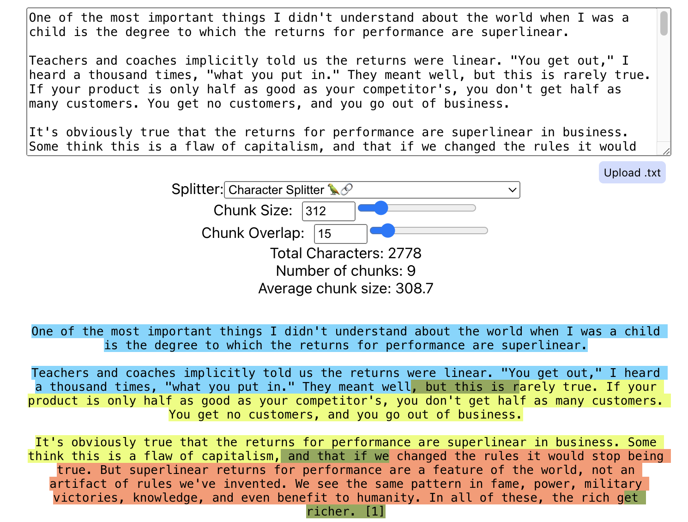

# 基于 Langchain 构建一个生产级 RAG 聊天机器人（一）：核心流程

在人工智能的浪潮下，由大型语言模型（LLM）赋能的问答（Q&A）聊天机器人正成为企业与用户互动的新常态。为了让聊天机器人具备真正的智能，满足用户多样化的提问需求，检索增强生成（RAG）技术应运而生。本文将深入剖析 RAG 技术的原理，并展示如何借助 LangChain 打造一个高效能的生产级聊天应用。

## RAG 概述

RAG 技术是一种用额外数据增强大型语言模型知识的方法。尽管 LLM 能够对众多主题进行推理，但其知识仅限于训练时使用的特定时间点之前的公开数据。因此，为了让聊天机器人能够对私有数据或截止日期后引入的数据进行推理，我们需要用特定的信息来增强模型的知识。这个过程就是检索增强生成（RAG）。

## RAG 架构

一个典型的 RAG 应用主要包含两个部分：

- **索引**：从源数据中加载数据并进行索引，通常离线进行，并且支持动态更新，分为：
  1. **加载**：根据不同的数据源选择合适的加载器，加载数据得到文档。
  2. **切分**：使用文本切分器将文档切分成更小的片段，使用小片段一方面可以更好地匹配用户问题，同时也可以适应模型的有限上下文窗口。
  3. **存储**：存储和索引切片，以便在检索时能够快速找到相关的数据，通常使用 Embeddings 模型和向量数据库（VectorStore）来完成。

- **检索与生成**：实际的 RAG 链，接收用户问题，从索引中检索相关数据，基于问题和这些数据生成结果，分为：
  1. **检索**：给定用户输入，使用检索器从存储中检索相关的切片。
  2. **生成**：使用包括问题和检索到的数据的提示调用 LLM 来生成答案。


## 基础流程

LangChain 是一个功能强大的框架，帮助开发者利用 LLM 快速构建出适应各种场景的智能应用。它提供了多种组件，可以帮助我们构建问答应用，以及更一般的 RAG 应用。下面我们将展示如何使用 LangChain 构建一个生产级的 RAG 聊天机器人。

### 准备工作

- **安装 Python**：建议使用 Python 3.8 或更高版本，这是当前许多现代 Python 库和框架的通用要求。
- **安装依赖**：使用 pip 安装 LangChain 及其相关依赖
  
  ```bash
  pip install --upgrade --quiet langchain langchain-community langchainhub langchain-openai
  ```

- **获取 OpenAI 密钥**：这里选择使用 OpenAI 的 GPT 系列模型作为我们的 LLM。所以需要注册一个 OpenAI 账号，然后创建一个 API 密钥。
- **注册 LangSmith (可选)**：使用 LangSmith，可以对 LangChain 的调用进行跟踪和分析，强烈建议使用。

### 加载配置

项目中需要用到的配置信息，推荐使用 `.env` 文件进行加载，同时记得在 `.gitignore` 中排除这个文件，避免将敏感信息泄霩。

```env
# .env
OPENAI_API_KEY="sk-xxx"
# OPENAI_API_BASE="https://api.openai.com/v1"

# LANGCHAIN_TRACING_V2=true
# LANGCHAIN_API_KEY=xxx
```

接着在项目中加载配置信息：

```python
from dotenv import load_dotenv
dotenv.load_dotenv()
```

### 索引：加载数据

LangChain 提供了多种加载器，可以帮助我们从不同的数据源中加载数据，包括常见的 CSV、HTML、JSON、Markdown、PDF等。基本上你能想到的数据源（甚至语雀）都有相应的加载器，详细的加载器列表可以参考[官方文档](https://python.langchain.com/docs/integrations/document_loaders)。

下面我们以加载一个简单的 PDF 文件为例：

```shell
pip install pypdf
```

```python
from langchain_community.document_loaders import PyPDFLoader

loader = PyPDFLoader("https://arxiv.org/pdf/2402.16480.pdf")
docs = loader.load()
print(len(docs))
print(docs[0].page_content)
```

在上面的代码中，我们使用了 `PyPDFLoader` 来加载一个 PDF 文件，然后打印出了文档的长度和第一页的内容。

`PyPDFLoader` 默认不处理图片，如果需要提取图片，可以借助 `rapidocr-onnxruntime` 库：

```shell
pip install rapidocr-onnxruntime
```

```python
loader = PyPDFLoader("https://arxiv.org/pdf/2402.16480.pdf", extract_images=True)
```

除了适用于常见格式的 `PyPDFLoader`，LangChain 还提供了其他针对不同类型 PDF 文件的加载器，比如 `MathpixPDFLoader`、`UnstructuredPDFLoader`等具体实现，可以根据实际情况选择，详细介绍可以参考[官方文档](https://python.langchain.com/docs/modules/data_connection/document_loaders/pdf)。

### 索引：切分数据

切分器是将文档切分成更小的片段，以便于更好地匹配用户问题，同时也可以适应模型的有限上下文窗口。LangChain 提供了多种切分器，包括基于段落、句子、词等不同粒度的切分器，详细的切分器列表可以参考[官方文档](https://python.langchain.com/docs/modules/data_connection/document_transformers/)。

下面我们以切分器为例，展示如何使用 `RecursiveCharacterTextSplitter` 切分文档：

```python
from langchain_text_splitters import RecursiveCharacterTextSplitter

text_splitter = RecursiveCharacterTextSplitter(
    chunk_size=1000, chunk_overlap=200, add_start_index=True
)
splits = text_splitter.split_documents(docs)
print(len(splits))
print(splits[0].page_content)
print(splits[0].metadata)
```

在上面的代码中，我们使用了 `RecursiveCharacterTextSplitter` 来切分文档，然后打印出了切分后的切片数量、第一个切片的内容和元数据。

在使用 `RecursiveCharacterTextSplitter` 时，我们可以使用 `chunk_size` 来控制切分的粒度，`chunk_overlap` 来控制切片的重叠，重叠的部分可以保证切片之间的上下文连贯性。此外，我们还可以使用 `add_start_index` 来控制是否在切片的元数据中添加起始索引。这里推荐一个网站 [https://chunkviz.up.railway.app/](https://chunkviz.up.railway.app/)，可以帮助我们直观地理解切分的效果。


如果要使用 `RecursiveCharacterTextSplitter` 来切分代码，可以通过结合 `Language` 类来实现：

```python
from langchain_text_splitters import (
    Language,
    RecursiveCharacterTextSplitter,
)

python_splitter = RecursiveCharacterTextSplitter.from_language(
    language=Language.PYTHON, chunk_size=50, chunk_overlap=0
)
```

除了适用于一般文本的 `RecursiveCharacterTextSplitter`，LangChain 还提供了其他针对不同类型文档或者不同切分方式的切分器，比如：

- `MarkdownHeaderTextSplitter` 用于通过指定标题切分 Markdown 文件
- `RecursiveJsonSplitter` 用于切分 JSON 文件
- `CharacterTextSplitter` 用于通过指定分隔符切分文本

关于文档切分器的详细介绍可以参考[官方文档](https://python.langchain.com/docs/modules/data_connection/document_transformers/text_splitter)。

### 索引：嵌入数据

嵌入器是将文档切片转换成向量（embeddings），以便存储到向量数据库（VectorStore）中。Embeddings 的本质是将文本映射到一个高维空间中的向量，使得语义相似的文本在空间中的距离更近。LangChain 提供了多种嵌入器，包括 OpenAI, Cohere, Hugging Face 等提供的多种模型，详细的嵌入器列表可以参考[官方文档](https://python.langchain.com/docs/integrations/text_embedding/)。

下面我们以嵌入器为例，展示如何使用 `OpenAIEmbeddings` 嵌入文档切片：

```python
from langchain_openai import OpenAIEmbeddings

embedding = OpenAIEmbeddings()
embedded_query = embedding.embed_query("What was the name mentioned in the conversation?")
print(embedded_query[:5])
```

```console
[0.005384807424727807, -0.0005522561790177147, 0.03896066510130955, -0.002939867294003909, -0.008987877434176603]
```

在上面的代码中，我们使用了 `OpenAIEmbeddings` 来嵌入查询，然后打印出了嵌入后的前 5 个元素。

LangChain 中的 Embeddings 接口提供了 `embed_query` 和 `embed_documents` 两个方法，分别用于嵌入查询和文档切片。因为不同的嵌入器可能会针对文档和查询提供不同的实现。

### 索引：存储数据

存储器是将嵌入后的 embeddings 存储到向量数据库（VectorStore）中，以便在检索时能够快速找到相关的数据。使用 embeddings 和向量数据库可以实现语义匹配，这也是 RAG 和传统关键词匹配的区别。最常见的相似度计算方法是使用余弦相似度。

LangChain 提供了多种存储器，常见开源可本地部署的有 Chroma、Faiss、Lance 等，详细的存储器列表可以参考[官方文档](https://python.langchain.com/docs/integrations/vectorstores/)。

下面我们以存储器为例，展示如何使用 `ChromaVectorStore` 存储嵌入后的 embeddings：

```python
from langchainhub.vectorstores import ChromaVectorStore

vectorstore = Chroma.from_documents(documents=splits, embedding=embedding)
query = "如何在开源项目中使用 ChatGPT ?"
docs = vectorstore.similarity_search(query)
print(docs[0].page_content)
```

在上面的代码中，我们使用了 `Chroma` 来存储嵌入后的 embeddings，然后使用 `similarity_search` 方法通过查询文本检索数据。这里需要留意的是，虽然原始的 PDF 文档是英文，而代码中的查询是中文，但依然可以查询到相关文档，这就是语义搜索的魅力。除了 `similarity_search`，我们还可以使用 `similarity_search_by_vector` 直接通过向量检索数据。

### 检索

检索器根据用户输入，输出相关的文档列表。LangChain 内置了多种检索器，最常见和简单的是基于向量数据库的检索器，详细的检索器列表可以参考[官方文档](https://python.langchain.com/docs/modules/data_connection/retrievers/#advanced-retrieval-types)。不同的检索器适合不同的场景，可以参照官方提供的对比表格进行选择：

| 名称 | 索引类型 | 使用LLM | 使用时机 | 描述 |
| --- | ------- | ------ | ------- | ---- |
| [Vectorstore](https://python.langchain.com/docs/modules/data_connection/retrievers/vectorstore) | 向量存储 | 否 | 如果你刚开始，正在寻找快速简单的方法。 | 这是获取开始的最简单方法。它涉及为每个文本创建嵌入。 |
| [ParentDocument](https://python.langchain.com/docs/modules/data_connection/retrievers/parent_document_retriever) | 向量存储 + 文档存储 | 否 | 如果你的页面有很多更小的独立信息块，它们最好单独索引，但最好一起检索。 | 这涉及为每个文档索引多个块。然后你在嵌入空间找到最相似的块，但检索整个父文档并返回（而不是单个块）。 |
| [Multi Vector](https://python.langchain.com/docs/modules/data_connection/retrievers/multi_vector) | 向量存储 + 文档存储 | 有时在索引期间 | 如果你能够从文档中提取出你认为比文本本身更有索引价值的信息。 | 这涉及为每个文档创建多个向量。每个向量的创建方式有很多种 - 例如包括文本的摘要和假设性问题。 |
| [Self Query](https://python.langchain.com/docs/modules/data_connection/retrievers/self_query) | 向量存储 | 是 | 如果用户提出的问题更适合根据元数据而不是与文本的相似性来检索文档。 | 这使用LLM将用户输入转换为两件事：（1）用于语义查找的字符串，（2）与之相关的元数据过滤器。这很有用，因为很多时候问题是关于文档的元数据（而不是内容本身）。 |
| [Contextual Compression](https://python.langchain.com/docs/modules/data_connection/retrievers/contextual_compression) | 任何 | 有时 | 如果你发现检索到的文档包含太多无关信息，分散了LLM的注意力。 | 这在另一个检索器之上放置了一个后处理步骤，只提取检索到的文档中最相关的信息。这可以使用嵌入或LLM来完成。 |
| [Time-Weighted Vectorstore](https://python.langchain.com/docs/modules/data_connection/retrievers/time_weighted_vectorstore) | 向量存储 | 否 | 如果你有关联时间戳的文档，并希望检索最新的文档。 | 这根据语义相似性（如正常向量检索）和最近性（查看索引文档的时间戳）来检索文档。 |
| [Multi-Query Retriever](https://python.langchain.com/docs/modules/data_connection/retrievers/MultiQueryRetriever) | 任何 | 是 | 如果用户提出的问题复杂，需要多个独立的信息块来回答。 | 这使用LLM从原始问题生成多个查询。当原始问题需要关于多个主题的信息块才能得到正确回答时，这很有用。通过生成多个查询，我们可以为每个查询获取文档。 |
| [Ensemble](https://python.langchain.com/docs/modules/data_connection/retrievers/ensemble) | 任何 | 否 | 如果你有多重检索方法，并希望尝试将它们结合。 | 这从多个检索器获取文档，然后将它们组合。 |
| [Long-Context Reorder](https://python.langchain.com/docs/modules/data_connection/retrievers/long_context_reorder) | 任何 | 否 | 如果你使用长上下文模型，并发现它没有关注检索文档中间的信息。 | 这从底层检索器获取文档，然后重新排序，使最相似的文档位于开始和结束处。这很有用，因为已经显示，对于更长的上下文模型，它们有时不会关注上下文窗口中间的信息。 |

除了内置检索器，LangChain 还支持集成多种外部检索器，详细列表可以参考[官方文档](https://python.langchain.com/docs/integrations/retrievers/)。此外，LangChain 还支持自定义检索器，示例代码可以参考[官方文档](https://python.langchain.com/docs/modules/data_connection/retrievers/#custom-retriever)。

下面我们展示如何使用 `VectorStoreRetriever` 检索数据：

```python
retriever = vectorstore.as_retriever(search_type="similarity", search_kwargs={"k": 6})
query = "如何在开源项目中使用 ChatGPT ?"
docs = retriever.invoke(query)
print(len(docs))
print(docs[0].page_content)
```

在上面的代码中，我们基于 `vectorstore` 创建了一个检索器，并且指定 `search_type="similarity"` 表示使用相似度检索，，`search_kwargs={"k": 6}` 表示最多返回 6 个结果，然后调用 `invoke` 方法检索数据。

### 生成

生成就是基于用户的问题和检索到的数据，拼装进提示，然后调用 LLM 生成答案。
下面我们展示如何使用 OpenAI 的 gpt-3.5-turbo 模型构造 chain 生成答案：

```python
from langchain_openai import ChatOpenAI
from langchain import hub
from langchain_core.output_parsers import StrOutputParser
from langchain_core.runnables import RunnablePassthrough

# 从 Hub 中加载 RAG Prompt
prompt = hub.pull("rlm/rag-prompt")
# 使用 OpenAI 的 gpt-3.5-turbo 模型
llm = ChatOpenAI(model_name="gpt-3.5-turbo", temperature=0)

# 格式化文档
def format_docs(docs):
    return "\n\n".join(doc.page_content for doc in docs)

# 构建 chain
rag_chain = (
    {"context": retriever | format_docs, "question": RunnablePassthrough()}
    | prompt
    | llm
    | StrOutputParser()
)

# 以流的方式生成答案
for chunk in rag_chain.stream("What is Task Decomposition?"):
    print(chunk, end="", flush=True)
```

在上面的代码中，我们使用了 `ChatOpenAI` 来加载 OpenAI 的 gpt-3.5-turbo 模型，然后构建了一个 chain，其中包含了检索、格式化、提示和生成等步骤。最后以流的方式生成答案。代码中涉及到的关键概念有：

- `hub.pull`：从 Hub 中加载 RAG Prompt，[Hub](https://smith.langchain.com/hub) 是 LangChain 提供的一个中心化的模型仓库，可以方便地获取和分享模型。
- `|`：管道操作符，用于连接多个 Runnable。基于 LangChain Expression Language (LCEL) 的语法，可以方便地构建复杂的 chain，类似于 Unix 管道。LCEL 提供了非常多的特性，包括异步、批量执行、并发执行、流式、重试和回退等，在我看来就是 LangChain 的精髓所在，详细介绍可以参考[官方文档](https://python.langchain.com/docs/expression_language/)。
- `RunnablePassthrough`：一个简单的 Runnable，用于传递输入
- `StrOutputParser`：一个简单的 OutputParser，用于将输出转换成字符串
- `stream`：以流的方式生成答案

LangChain 针对 LLM 的调用提供了两种不同的抽象：`ChatModel` 和 `LLM`。前者接收聊天消息列表返回单个聊天消息，比如我们上面代码中使用的 `ChatOpenAI`；后者接收一个字符串返回一个字符串。这两种抽象可以根据实际情况选择，详细对比和介绍可以参考[官方文档](https://python.langchain.com/docs/modules/model_io/quick_start)。

## 总结

好了，到这里我们已经完成了一个简单的 RAG 聊天机器人的构建，可以看出 LangChain 提供了非常多的组件和特性，从而帮助我们快速构建出适应各种场景的智能应用。限于篇幅，这篇文章就先到这里，在后续文章中我们将继续深入探讨搭建一个生产级 RAG 聊天机器人所需要的更多高级特性，比如多模型集成、多语言支持、多轮对话、实时更新等，敬请期待！
