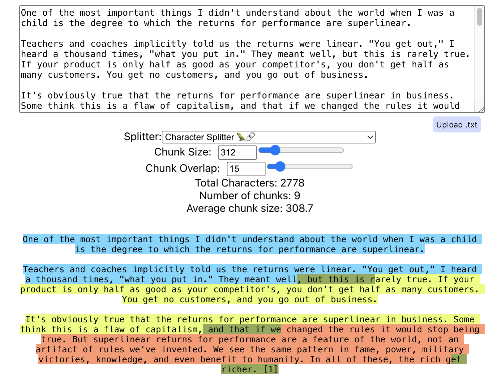
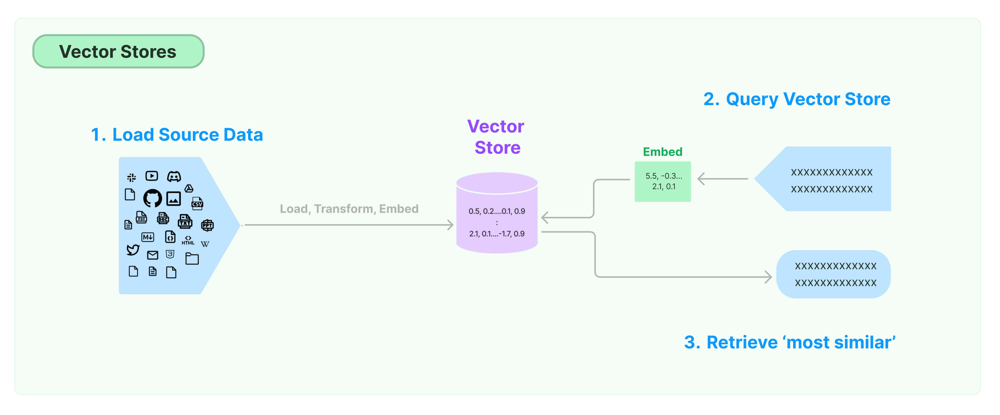

# 基于 Langchain 构建一个生产级 RAG 聊天机器人
在人工智能的浪潮下，由大型语言模型（LLM）赋能的问答（Q&A）聊天机器人正成为企业与用户互动的新常态。为了让聊天机器人具备真正的智能，满足用户多样化的提问需求，检索增强生成（RAG）技术应运而生。本文将深入剖析 RAG 技术的原理，并展示如何借助 LangChain 打造一个高效能的生产级聊天应用。
## RAG 概述
RAG 技术是一种用额外数据增强大型语言模型知识的方法。尽管 LLM 能够对众多主题进行推理，但其知识仅限于训练时使用的特定时间点之前的公开数据。因此，为了让聊天机器人能够对私有数据或截止日期后引入的数据进行推理，我们需要用特定的信息来增强模型的知识。这个过程就是检索增强生成（RAG）。
## RAG 架构
一个典型的 RAG 应用主要包含两个部分：
- **索引**：从源数据中加载数据并进行索引，通常离线进行，并且支持动态更新，分为：
  1. **加载**：根据不同的数据源选择合适的加载器，加载数据得到文档。
  2. **切分**：使用文本切分器将文档切分成更小的片段，使用小片段一方面可以更好地匹配用户问题，同时也可以适应模型的有限上下文窗口。
  3. **存储**：存储和索引切片，以便在检索时能够快速找到相关的数据，通常使用 Embeddings 模型和向量数据库（VectorStore）来完成。

- **检索与生成**：实际的 RAG 链，接收用户问题，从索引中检索相关数据，基于问题和这些数据生成结果，分为：
  1. **检索**：给定用户输入，使用检索器从存储中检索相关的切片。
  2. **生成**：使用包括问题和检索到的数据的提示调用 LLM 来生成答案。

## 基础流程
LangChain 是一个功能强大的框架，帮助开发者利用 LLM 快速构建出适应各种场景的智能应用。它提供了多种组件，可以帮助我们构建问答应用，以及更一般的 RAG 应用。下面我们将展示如何使用 LangChain 构建一个生产级的 RAG 聊天机器人。
### 准备工作
- **安装 Python**：建议使用 Python 3.8 或更高版本，这是当前许多现代 Python 库和框架的通用要求。
- **安装依赖**：使用 pip 安装 LangChain 及其相关依赖
  ```bash
  pip install --upgrade --quiet langchain langchain-community langchainhub langchain-openai
  ```
- **获取 OpenAI 密钥**：这里选择使用 OpenAI 的 GPT 系列模型作为我们的 LLM。所以需要注册一个 OpenAI 账号，然后创建一个 API 密钥。
- **注册 LangSmith (可选)**：使用 LangSmith，可以对 LangChain 的调用进行跟踪和分析，强烈建议使用。
### 加载配置
项目中需要用到的配置信息，推荐使用 `.env` 文件进行加载，同时记得在 `.gitignore` 中排除这个文件，避免将敏感信息泄霩。
```
# .env
OPENAI_API_KEY="sk-xxx"
# OPENAI_API_BASE="https://api.openai.com/v1"

# LANGCHAIN_TRACING_V2=true
# LANGCHAIN_API_KEY=xxx
```
接着在项目中加载配置信息：
```python
from dotenv import load_dotenv
dotenv.load_dotenv()
```
### 索引：加载数据
LangChain 提供了多种加载器，可以帮助我们从不同的数据源中加载数据，包括常见的 CSV、HTML、JSON、Markdown、PDF等。基本上你能想到的数据源（甚至语雀）都有相应的加载器，详细的加载器列表可以参考[官方文档](https://python.langchain.com/docs/integrations/document_loaders)。

下面我们以加载一个简单的 PDF 文件为例：
```shell
pip install pypdf
```
```python
from langchain_community.document_loaders import PyPDFLoader

loader = PyPDFLoader("https://arxiv.org/pdf/2402.16480.pdf")
docs = loader.load()
print(len(docs))
print(docs[0].page_content)
```
在上面的代码中，我们使用了 `PyPDFLoader` 来加载一个 PDF 文件，然后打印出了文档的长度和第一页的内容。

`PyPDFLoader` 默认不处理图片，如果需要提取图片，可以借助 `rapidocr-onnxruntime` 库：
```shell
pip install rapidocr-onnxruntime
```
```python
loader = PyPDFLoader("https://arxiv.org/pdf/2402.16480.pdf", extract_images=True)
```

除了适用于常见格式的 `PyPDFLoader`，LangChain 还提供了其他针对不同类型 PDF 文件的加载器，比如 `MathpixPDFLoader`、`UnstructuredPDFLoader`等具体实现，可以根据实际情况选择，详细介绍可以参考[官方文档](https://python.langchain.com/docs/modules/data_connection/document_loaders/pdf)。

### 索引：切分数据
切分器是将文档切分成更小的片段，以便于更好地匹配用户问题，同时也可以适应模型的有限上下文窗口。LangChain 提供了多种切分器，包括基于段落、句子、词等不同粒度的切分器，详细的切分器列表可以参考[官方文档](https://python.langchain.com/docs/modules/data_connection/document_transformers/)。

下面我们以切分器为例，展示如何使用 `RecursiveCharacterTextSplitter` 切分文档：
```python
from langchain_text_splitters import RecursiveCharacterTextSplitter

text_splitter = RecursiveCharacterTextSplitter(
    chunk_size=1000, chunk_overlap=200, add_start_index=True
)
splits = text_splitter.split_documents(docs)
print(len(splits))
print(splits[0].page_content)
print(splits[0].metadata)
```
在上面的代码中，我们使用了 `RecursiveCharacterTextSplitter` 来切分文档，然后打印出了切分后的切片数量、第一个切片的内容和元数据。

在使用 `RecursiveCharacterTextSplitter` 时，我们可以使用 `chunk_size` 来控制切分的粒度，`chunk_overlap` 来控制切片的重叠，重叠的部分可以保证切片之间的上下文连贯性。此外，我们还可以使用 `add_start_index` 来控制是否在切片的元数据中添加起始索引。这里推荐一个网站 [https://chunkviz.up.railway.app/](https://chunkviz.up.railway.app/)，可以帮助我们直观地理解切分的效果。


如果要使用 `RecursiveCharacterTextSplitter` 来切分代码，可以通过结合 `Language` 类来实现：
```python
from langchain_text_splitters import (
    Language,
    RecursiveCharacterTextSplitter,
)

python_splitter = RecursiveCharacterTextSplitter.from_language(
    language=Language.PYTHON, chunk_size=50, chunk_overlap=0
)
```

除了适用于一般文本的 `RecursiveCharacterTextSplitter`，LangChain 还提供了其他针对不同类型文档或者不同切分方式的切分器，比如：
- `MarkdownHeaderTextSplitter` 用于通过指定标题切分 Markdown 文件
- `RecursiveJsonSplitter` 用于切分 JSON 文件
- `CharacterTextSplitter` 用于通过指定分隔符切分文本

关于文档切分器的详细介绍可以参考[官方文档](https://python.langchain.com/docs/modules/data_connection/document_transformers/text_splitter)。
### 索引：嵌入数据
嵌入器是将文档切片转换成向量（embeddings），以便存储到向量数据库（VectorStore）中。Embeddings 的本质是将文本映射到一个高维空间中的向量，使得语义相似的文本在空间中的距离更近。LangChain 提供了多种嵌入器，包括 OpenAI, Cohere, Hugging Face 等提供的多种模型，详细的嵌入器列表可以参考[官方文档](https://python.langchain.com/docs/integrations/text_embedding/)。

下面我们以嵌入器为例，展示如何使用 `OpenAIEmbeddings` 嵌入文档切片：
```python
from langchain_openai import OpenAIEmbeddings

embedding = OpenAIEmbeddings()
embedded_query = embedding.embed_query("What was the name mentioned in the conversation?")
print(embedded_query[:5])
```
```
[0.005384807424727807, -0.0005522561790177147, 0.03896066510130955, -0.002939867294003909, -0.008987877434176603]
```
在上面的代码中，我们使用了 `OpenAIEmbeddings` 来嵌入查询，然后打印出了嵌入后的前 5 个元素。

LangChain 中的 Embeddings 接口提供了 `embed_query` 和 `embed_documents` 两个方法，分别用于嵌入查询和文档切片。因为不同的嵌入器可能会针对文档和查询提供不同的实现。
### 索引：存储数据
存储器是将嵌入后的 embeddings 存储到向量数据库（VectorStore）中，以便在检索时能够快速找到相关的数据。使用 embeddings 和向量数据库可以实现语义匹配，这也是 RAG 和传统关键词匹配的区别。最常见的相似度计算方法是使用余弦相似度。

LangChain 提供了多种存储器，常见开源可本地部署的有 Chroma、Faiss、Lance 等，详细的存储器列表可以参考[官方文档](https://python.langchain.com/docs/integrations/vectorstores/)。

下面我们以存储器为例，展示如何使用 `ChromaVectorStore` 存储嵌入后的 embeddings：
```python
from langchainhub.vectorstores import ChromaVectorStore

vectorstore = Chroma.from_documents(documents=splits, embedding=embedding)
query = "如何在开源项目中使用 ChatGPT ?"
docs = vectorstore.similarity_search(query)
print(docs[0].page_content)
```
在上面的代码中，我们使用了 `Chroma` 来存储嵌入后的 embeddings，然后使用 `similarity_search` 方法通过查询文本检索数据。除了 `similarity_search`，我们还可以使用 `similarity_search_by_vector` 直接通过向量检索数据。
### 检索
### 生成
